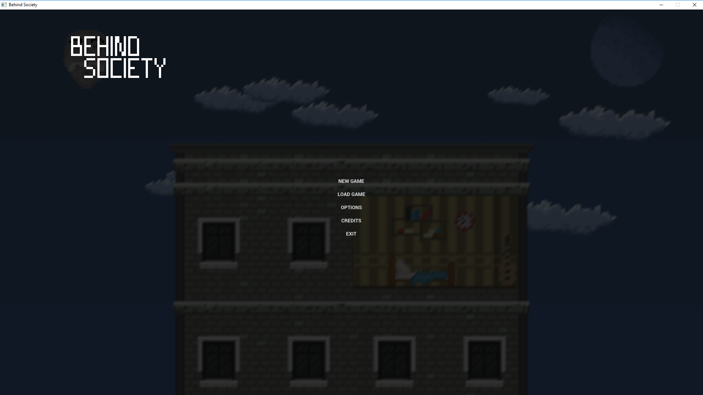
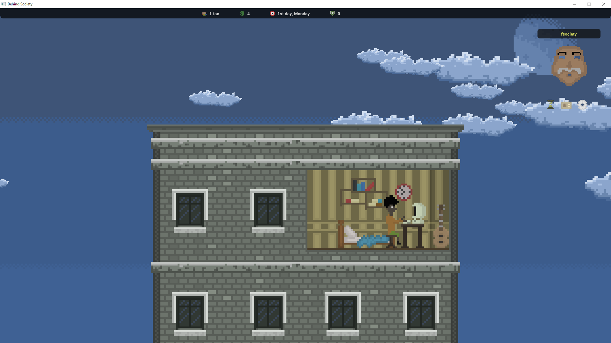
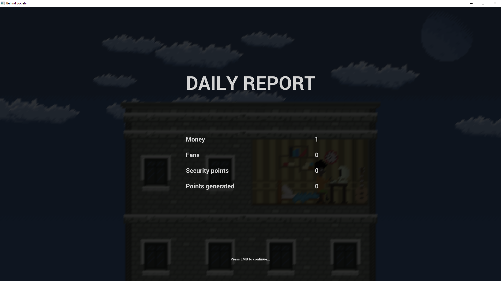

# Behind Society
Strategy game about hacking written in C++/SFML/Lua/ImGui

# Story
You are teenager, you are 17. You live with your mom. In the school you are total looser. You tried so much times to make friends, but all my attempts were unsuccessful. You have something what thrust everyone away - you are nerd. One day in the school, you said "That's enough!". You decided to act. You had enough of everyone ignoring you and your genius. You have extraordinary IT skills, so you put them to good use. You hacked the main school computer and made a big mess with everyones data, grades and names. When you did this you felt like you had unlimited power. You felt you can do anything you ever wanted. Your goal is to launch the biggest hacker attack in history, but in order to make it happen your plan needs resources...

# A few screenshots

